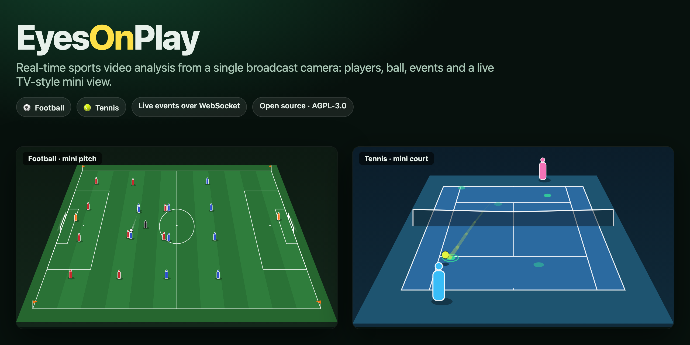
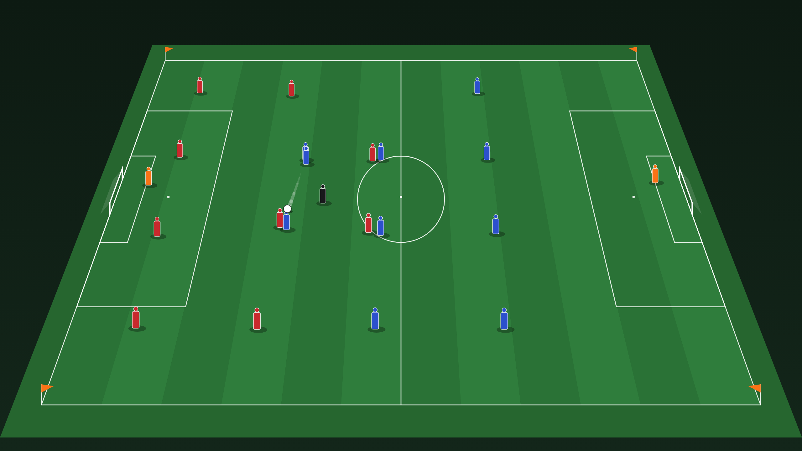
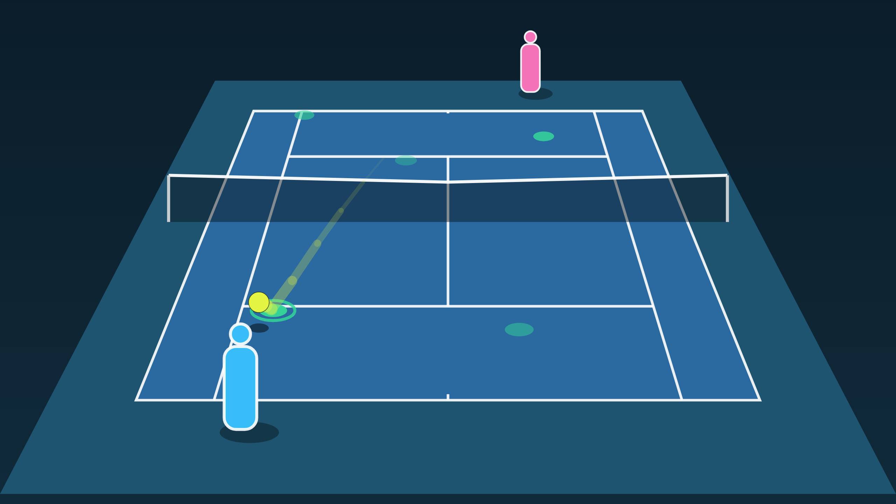
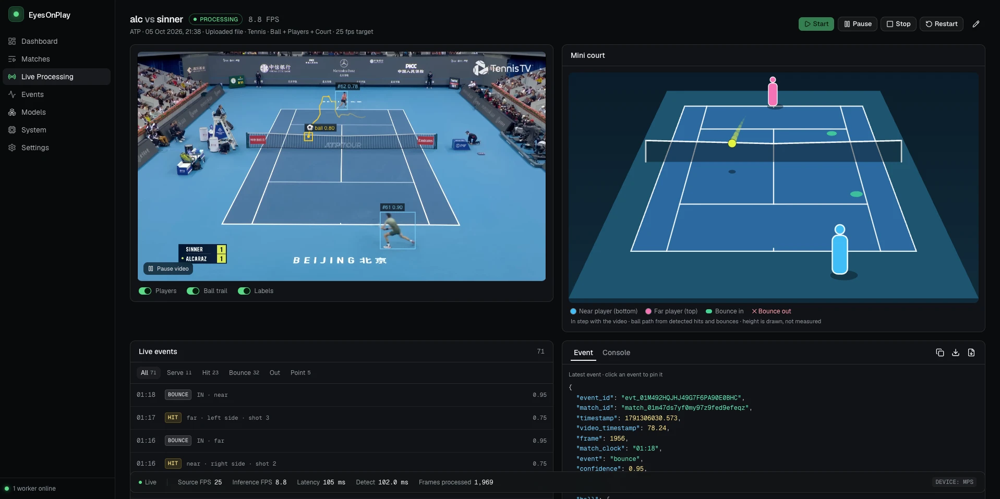
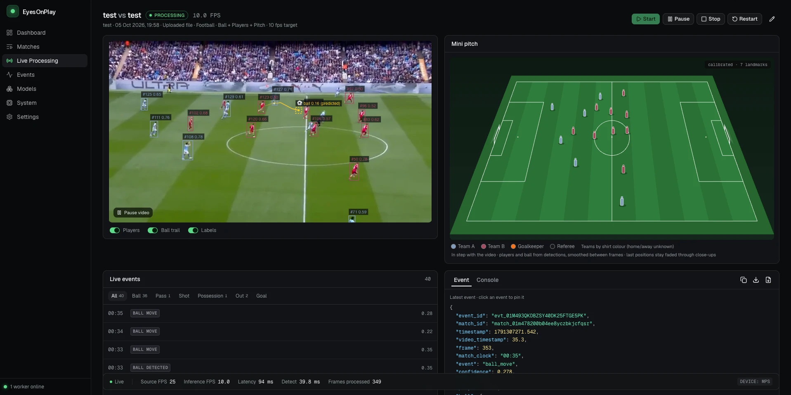

# EyesOnPlay

[](https://github.com/eyesonplay/eyesonplay/actions/workflows/ci.yml)
[](LICENSE)
[](https://eyesonplay.com)

**Website and documentation: [eyesonplay.com](https://eyesonplay.com)**



Real-time sports video analysis from a single broadcast camera, for football and
tennis. An admin creates a match, points it at a live stream (HLS/RTMP), a video
URL or an uploaded file, and starts AI processing. The dashboard shows the video
with ball/player overlays next to a TV-style animated mini pitch or court, a
live event feed (passes, shots, corners, serves, bounces, points…) and the raw
JSON of every event, all streamed over WebSocket. External systems can consume
the events through an API-key protected integration feed.

Licensed under the [GNU AGPL-3.0](LICENSE); commercial licences are available
(see [Licence](#licence)).

| Football: TV-style mini pitch | Tennis: TV-style mini court |
|---|---|
|  |  |

**Live dashboard** (video with detection overlay, mini view, event feed, JSON
inspector and live metrics):




The mini views are drawn from the tracking data only: players glide between
analysed frames, the ball is smoothed, bounces and calls appear as they are
detected, and the view stays in step with the video. (Images: football from the
built-in match simulation, tennis from tracking data of a real broadcast.)

```
Live / uploaded video ─▶ FFmpeg ─▶ frame sampling ─▶ detector (YOLO | mock)
   ─▶ ball tracker (Kalman) + player tracker ─▶ pitch mapping (homography)
   ─▶ event engine ─▶ Redis (streams + pub/sub) ─▶ FastAPI ─▶ WebSocket ─▶ Next.js
```

| Service | Path | Stack |
|---|---|---|
| `frontend` | [frontend/](frontend/) | Next.js 16, TypeScript, Tailwind v4, shadcn/ui (Base UI), TanStack Query, hls.js |
| `api` | [backend/](backend/) | FastAPI, SQLAlchemy 2 (async), Alembic, PostgreSQL, Redis |
| `worker` | [inference-worker/](inference-worker/) | FFmpeg, NumPy, Ultralytics YOLO, Kalman/IoU tracking, NVML |
| event engine | [event-engine/](event-engine/) | Pure-Python rules library (no I/O), used by the worker |

Inference runs in its own service so GPU workers can scale independently; each
worker processes up to `MAX_CONCURRENT_MATCHES` matches and picks jobs from a
Redis consumer group.

## Quick start (no GPU needed)

```bash
docker compose up --build
```

Open <http://localhost:3000> and sign in with the local development account
**admin@example.com** / **eyesonplay-admin** (set `ADMIN_EMAIL` and
`ADMIN_PASSWORD` to use your own). Click **New match**, paste an HLS URL (for example
`https://test-streams.mux.dev/x36xhzz/x36xhzz.m3u8`) and press **Create & start
processing**. The worker runs in `INFERENCE_MODE=mock`: a simulated match (two
4-4-2 teams, passes, tackles, shots, ball out) is projected through a synthetic
camera and fed through the *real* tracking and event pipeline, so every
dashboard feature works without a GPU. Mock detections are not related to the
video's content.

| URL | |
|---|---|
| <http://localhost:3000> | Dashboard |
| <http://localhost:8000/docs> | OpenAPI docs |
| `ws://localhost:8000/ws/matches/{match_id}` | Live feed |

### Pitch calibration (mini pitch on real video)

Install the pitch keypoint model (Roboflow `sports`; code MIT, check the weights' terms in [docs/third-party.md](docs/third-party.md)) into the models folder:

```bash
pip install gdown
gdown -O ~/.pitchside/models/football-pitch-detection.pt "https://drive.google.com/uc?id=1Ma5Kt86tgpdjCTKfum79YMgNnSjcoOyf"
```

Matches using **Ball + Players + Pitch** then calibrate automatically: landmarks
are detected every 0.4 s, a homography is fitted with RANSAC and only trusted
once two consecutive fits agree. Between fits, camera pan/tilt/zoom is
followed with optical flow, so the calibration stays valid while the camera
follows the ball (up to 8 s without landmarks; a cut ends it). Frames with too
little grass in view (graphics, close-ups, crowd) drop the calibration at once.
Uncalibrated frames stay in pixel coordinates; the mini pitch keeps the last
positions faded for up to 15 s and otherwise says why.

Football events: ball detected/lost/moving, possession and possession change,
passes, shots, ball out and **corners** (the ball settles in a corner arc with a
player next to it).

**Teams** are separated by shirt colour (two-cluster k-means over torso colours,
labels kept stable, majority vote per track). The mini pitch and video overlay
use each team's kit colour. Teams are "A"/"B": which is home or away is unknown.

### Real computer vision

```bash
# CPU (slow, any machine): FFmpeg + YOLO
docker compose -f docker-compose.yml -f docker-compose.real.yml up --build
# NVIDIA GPU (L4 / A10 / T4 …, requires the NVIDIA Container Toolkit)
docker compose -f docker-compose.yml -f docker-compose.gpu.yml up --build
```

In real mode the worker decodes the source with FFmpeg at the configured
processing FPS and runs YOLO. Stock COCO weights (`yolov8n`) map *person →
player* and *sports ball → ball*; for good results use a football fine-tune whose
classes include `ball`, `player`, `goalkeeper`, `referee`. Drop the `.pt` into
the `models` volume and set the match's **Model weights** field. Without pitch
calibration, coordinates stay in pixels and `pitch` is `null`: pitch positions
are never invented.

### Docker stack + native GPU worker (Mac)

Docker on macOS cannot use the Apple GPU, so for real inference you can run the
worker natively (Apple MPS) against the Docker stack:

```bash
docker compose -f docker-compose.yml -f docker-compose.dev.yml up -d   # exposes Redis on :6380
docker compose -f docker-compose.yml -f docker-compose.dev.yml stop worker
cd inference-worker && REDIS_URL=redis://localhost:6380/0 INFERENCE_MODE=real \
  MEDIA_DIR=$HOME/.pitchside/media MODELS_DIR=$HOME/.pitchside/models .venv/bin/python -m worker.main
```

**Pitch calibration (real mode).** Put a 32-keypoint pitch model named
`football-pitch-detection.pt` (keypoint order of Roboflow's open-source
[`sports`](https://github.com/roboflow/sports) project) into the models folder
and use the *Ball + Players + Pitch* detection model. The worker then finds pitch
landmarks every 0.4 s, fits a homography (RANSAC) and accepts it only with at
least 4 well-spread landmarks and under 6 px reprojection error. A fit is
trusted for at most 1 s, so a panning camera never gets stale coordinates.
Without the model, or while searching, coordinates stay in pixels and the mini
pitch says why.

`docker-compose.dev.yml` bind-mounts uploads to `~/.pitchside/media`
(`MEDIA_HOST_DIR` to change it), so the API and the native worker see the same
files. Always pass both compose files; otherwise Redis and the API are recreated
without the shared port and folder.

## Local development without Docker

Device selection: CUDA, then Apple MPS (local development), then CPU.

Requires Python 3.12+, Node 22+, pnpm, FFmpeg and Redis (Postgres optional: the
API can run on SQLite for development).

```bash
# event engine + worker
cd inference-worker && uv venv -p 3.12 .venv && uv pip install -p .venv -e ../event-engine -e '.[dev]'
REDIS_URL=redis://localhost:6379/5 INFERENCE_MODE=mock MEDIA_DIR=../backend/media .venv/bin/python -m worker.main

# api (SQLite, tables created on startup)
cd backend && uv venv -p 3.12 .venv && uv pip install -p .venv -e '.[dev]'
DATABASE_URL=sqlite+aiosqlite:///./dev.db REDIS_URL=redis://localhost:6379/5 MEDIA_DIR=./media \
  AUTO_CREATE_SCHEMA=true .venv/bin/uvicorn app.main:app --port 8000

# frontend
cd frontend && pnpm install && pnpm dev
```

## Tests

```bash
cd event-engine && .venv/bin/pytest --cov=football_events     # rule engine (scripted trajectories)
cd inference-worker && .venv/bin/pytest --cov=worker          # trackers, homography, sim pipeline, runner, FFmpeg
cd backend && .venv/bin/pytest --cov=app                      # API, background consumers, watchdog, WebSocket
cd frontend && pnpm typecheck && pnpm lint && pnpm test       # unit tests (reducer, schema, formatters)
cd frontend && pnpm test:e2e                                  # Playwright, against a running stack
```

## Configuration

See [.env.example](.env.example). Main settings:

| Variable | Service | Default | |
|---|---|---|---|
| `INFERENCE_MODE` | worker | `mock` | `mock` or `real` |
| `MAX_CONCURRENT_MATCHES` | worker | `4` | matches per worker process |
| `DATABASE_URL` | api | Postgres in compose | `postgresql+asyncpg://…` |
| `REDIS_URL` | api, worker | `redis://redis:6379/0` | |
| `MEDIA_DIR` | api, worker | `/data/media` | shared uploads volume |
| `CORS_ORIGINS` | api | `http://localhost:3000` | comma separated |
| `ALLOW_PRIVATE_SOURCES` | worker | `false` | allow stream URLs on private/loopback hosts (SSRF guard); dev only |
| `NEXT_PUBLIC_API_URL` | frontend (build) | empty | empty means `<dashboard host>:8000`; `same-origin` behind a reverse proxy |
| `ADMIN_EMAIL`, `ADMIN_PASSWORD` | api | dev account | first dashboard user, created on startup if missing |
| `COOKIE_SECURE` | api | `false` | session cookie over HTTPS only; `true` in production |
| `SESSION_TTL_HOURS` | api | `336` | sign-in lifetime |
| `FEED_REQUESTS_PER_MINUTE` | api | `120` | integration feed limit per API key |

## How it works

- **Control.** `POST /api/matches/{id}/start` creates a processing session, writes the
  desired state to `match:{id}:control` and queues a start command on the
  `worker:commands` stream. Pause/stop/restart only change the desired state; the
  worker polls it, so commands are never lost. Restart starts a new session from
  the beginning of the source and clears the match's previous events.
- **Reliability.** Workers hold a short-lived lease per match and publish
  heartbeats. The API watchdog fails sessions whose worker disappears ("worker
  lost") or that no worker picks up. Sources reconnect with exponential backoff.
  Events are persisted from a Redis stream with a consumer group (at-least-once,
  idempotent inserts). The frontend WebSocket reconnects automatically and gets a
  snapshot on reconnect.
- **Events.** Possession needs several consecutive frames (with hysteresis), so a
  single noisy frame never changes it. Passes require a release, minimum travel
  and a different receiver. Shots are `shot_candidate` unless confidence passes
  the configured threshold, and without pitch calibration they are capped at low
  confidence and never promoted. Teams are A/B by shirt colour; player names are
  always `null` (there is no identity model).

Details: [docs/redis-contract.md](docs/redis-contract.md) ·
[docs/event-schema.md](docs/event-schema.md) · OpenAPI at `/docs`.

## Tennis

Matches have a **sport** (football or tennis). Tennis uses its own event
engine (`event-engine/tennis_events`) over the same ingestion, tracking,
WebSocket and dashboard:

- **Events:** `serve` (court, serve number), `hit` (near/far player, racket
  side), `bounce` (court position, in/out), `ball_out`, `fault`,
  `double_fault`, `point_won` (winner, reason, rally length). Teams/players are
  "near"/"far": names and forehand/backhand need identity and handedness,
  which are unknown.
- **How:** hits are direction reversals that send the ball away from a player;
  bounces are sharp upward kicks in the ball's on-screen motion, located on
  the court at that instant. Serves count once the ball crosses the net. Point
  endings are held 0.8 s and cancelled if the other player plays the ball.
- **Mock mode** simulates rallies (serves, faults, returns, outs, winners)
  through a broadcast-style camera. Against the simulation's ground truth over
  5 minutes: serves ~100%, return hits ~73%, points ~80% detected.
- **Real video, court (T2, done):** classical line detection (no model, no
  licence constraints): white-line mask, Hough lines, court-template fitting
  scored line by line. Cached while it still fits (broadcast cameras are
  mostly static); full searches run on a background thread. On a 1080p
  Beijing broadcast: court calibrated in 66% of frames (the rest are
  close-ups/replays), both players picked out of the crowd/officials in 86%.
- **Real video, ball:** a TrackNet ball tracker (3-frame heatmap network) and a
  CatBoost bounce classifier. On the same broadcast at 25 fps: ball found in
  71% of frames, court calibrated in 88% (the court is restored on the first
  wide frame after a close-up). 25 fps is needed: at 12 fps most bounces are
  lost. On an Apple laptop GPU this runs ~3x slower than real time; use an
  NVIDIA GPU for live matches.
- **Tennis model weights are not included** and their published source carries
  no licence: for personal evaluation, `tracknet_ball.pt` and
  `tennis_bounce.cbm` from [TennisProject](https://github.com/yastrebksv/TennisProject)
  go into the models folder. Without the bounce model a built-in rule is used.
  See [docs/third-party.md](docs/third-party.md).
- **Your own bounce model:** label bounces on the dashboard (**Label** on a
  match) and train a replacement with `python -m worker.training.bounce`; the
  worker prefers it automatically. See [docs/training.md](docs/training.md).

A worker takes any queued job, so run either the mock worker (Docker) or the
native real-mode worker against one stack, not both.

## Roadmap

| Phase | Scope | Status |
|---|---|---|
| 1 | Structure, DB, match CRUD, dashboard, player, WebSocket, mock inference | done |
| 2 | FFmpeg ingestion, frame sampling, YOLO detection, Kalman ball tracking, overlay | implemented; verified end-to-end on Apple MPS with test clips (players tracked, ~10 FPS, ~30 ms latency). Ball accuracy on real broadcast footage not yet validated; use a football fine-tune |
| 3 | ByteTrack player tracking on real video, possession on real footage | tracker interface in place (IoU + motion today) |
| 4 | Event detection (pass, shot candidates, possession change) | engine done; tuning on real footage pending |
| 5 | Pitch keypoints, automatic homography, mini pitch on real video | automatic per-frame calibration with Roboflow's 32-keypoint pitch model (RANSAC, consecutive-fit confirmation, staleness limit). ~50% of broadcast match frames calibrated; positions approximate (several metres) |
| 6 | TensorRT/ONNX, multi-match GPU scaling | not started |

## Production

[docs/deployment.md](docs/deployment.md) runs EyesOnPlay on one server with
`docker-compose.prod.yml`: Caddy serves the dashboard and API on one HTTPS
origin with automatic certificates, the database is backed up nightly, and the
API and dashboard ports are not exposed. The compose defaults (Postgres
`football`, the dev admin account) are for local development only; production
refuses to start until `DOMAIN`, `ADMIN_EMAIL`, `ADMIN_PASSWORD` and
`POSTGRES_PASSWORD` are set.

**Security:**
- **Dashboard login:** every dashboard route, uploaded video and the live
  WebSocket require a signed-in user. Passwords are hashed with Argon2id;
  sessions are random tokens in an HttpOnly, SameSite cookie (HTTPS-only in
  production), stored hashed and expiring after 14 days. Cross-site requests
  are refused. Repeated failed sign-ins are rate limited per email and per IP.
  Manage users with `python -m app.cli` (create, set password, disable, list).
- **Integration feed:** API keys (shown once, stored hashed, revocable in
  **Settings → API keys**), rate limited per key.
- **Video sources:** FFmpeg runs with a protocol whitelist, and stream hosts
  that resolve to private addresses are refused.

## Licence

EyesOnPlay is free software under the [GNU Affero General Public License v3.0](LICENSE).
If you run a modified version as a network service, the AGPL requires you to
offer its source to the service's users.

**Commercial licences** (for closed-source products or services, without the
AGPL obligations) are available from the maintainers: open an issue or contact
us through [github.com/eyesonplay](https://github.com/eyesonplay).

Third-party software and models keep their own licences; model weights are not
distributed here. Notably YOLO (Ultralytics) is AGPL-3.0 and the tennis weights
carry no licence. See [docs/third-party.md](docs/third-party.md).

Contributions: see [CONTRIBUTING.md](CONTRIBUTING.md). Changes:
[CHANGELOG.md](CHANGELOG.md).
